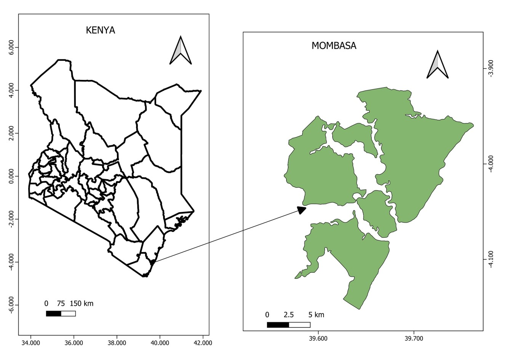
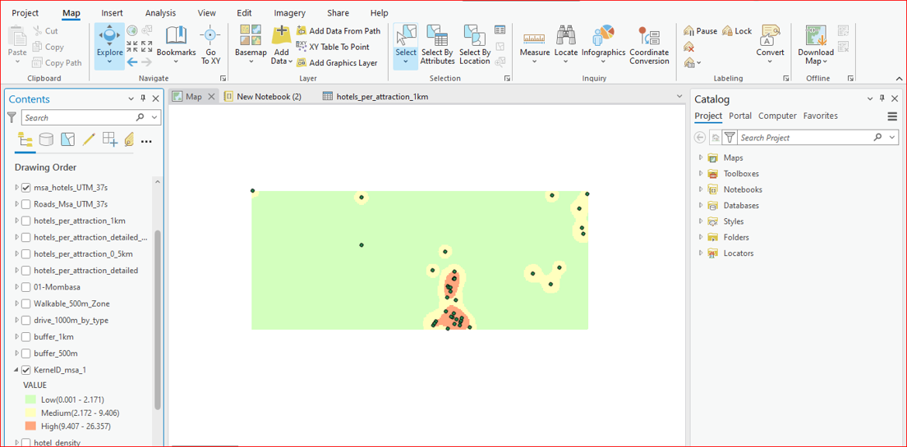
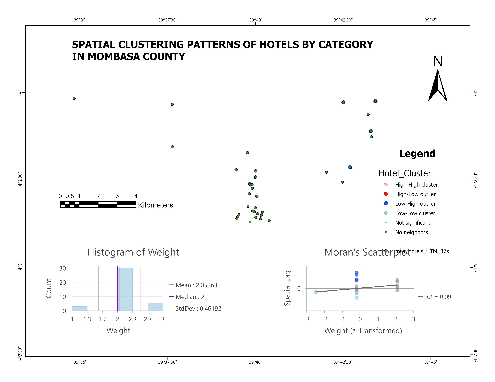
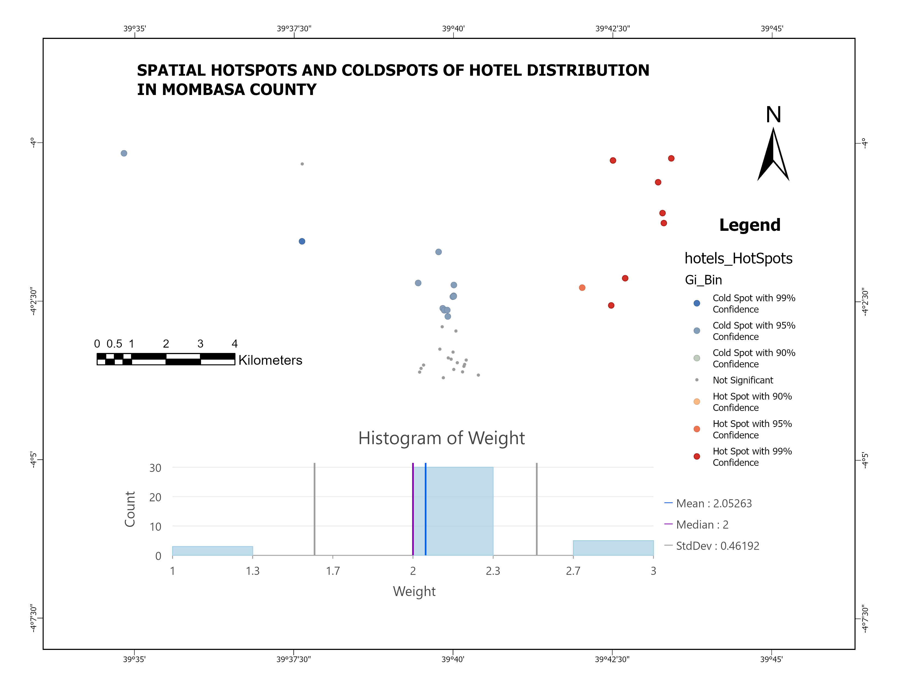
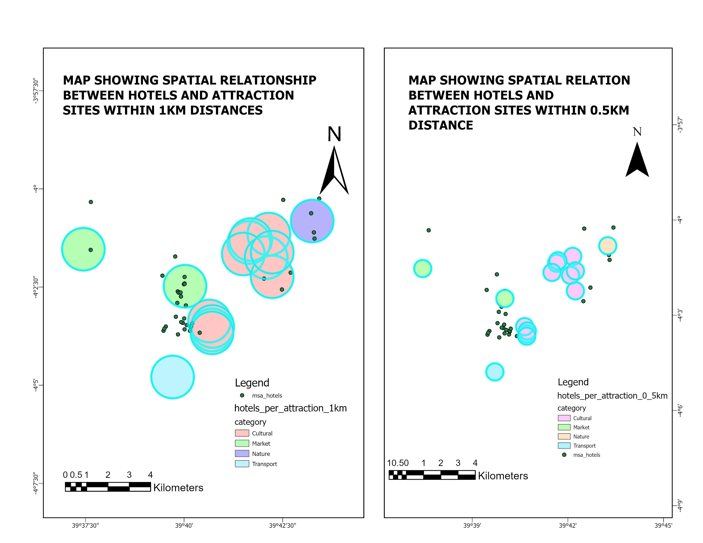
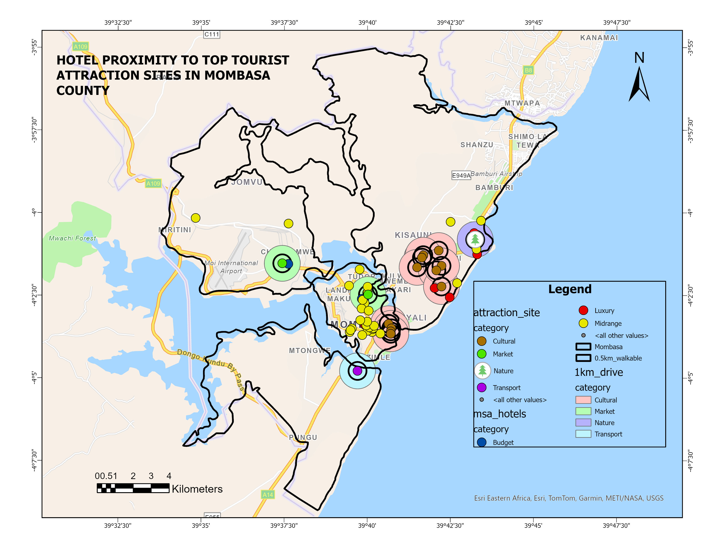

# 🗺️ GIS Analysis of Hotel Distribution in Mombasa County

> **GIS project examining the spatial relationship between hotels and tourist attractions in Mombasa County, identifying overconcentration along the coast and underserved inland sites.**

---

## 📌 Project Overview

This geospatial analysis examines the spatial distribution of hotels across Mombasa County relative to tourist attractions. Using kernel density estimation, spatial autocorrelation, hotspot analysis, and buffer accessibility mapping, the study reveals a heavy coastal concentration of hotels in Nyali, Bamburi, and Shanzu — while culturally significant inland sites such as Kaya Forests and Fort Jesus remain largely underserved. The findings support evidence-based recommendations for balanced tourism infrastructure development.

---

## 🗂️ Repository Structure

```
Mombasa-Hotel-GIS-Analysis/
│
├── maps/
│   ├── study_Area.jpg          # Mombasa County location map
│   ├── Kernel Density.png      # Hotel density heatmap
│   ├── Hotel_cluster.jpg       # Moran's I clustering analysis
│   ├── Hotel hotspot.jpg       # Gi* hotspot/coldspot analysis
│   ├── Buffer_analysis.jpg     # 500m & 1km accessibility buffers
│   └── Thematic map.jpg        # Final composite map
│
└── README.md
```

---

## 🔢 Data Sources

| Dataset | Source |
|---|---|
| Hotel locations | OpenStreetMap |
| Tourist attractions | OpenStreetMap |
| Mombasa administrative boundary | HDX |
| Road network | OpenStreetMap |
| Basemap | OpenStreetMap Standard |

---

## ⚙️ Methodology

### Step 1 — Study Area

Mombasa County was defined as the area of interest, with its administrative boundary sourced from the Humanatarian Data Exchange. This provided the spatial extent for all subsequent analysis.


*Figure 1: Location of Mombasa County, Kenya*

---

### Step 2 — Data Collection & Classification

Hotels were classified by type and assigned weights for density analysis:

| Hotel Type | Weight |
|---|---|
| Luxury | 3 |
| Midrange | 2 |
| Budget | 1 |

Tourist attractions were grouped into four categories: Cultural (e.g., Fort Jesus), Market (e.g., Kongowea Market), Nature (e.g., Haller Park), and Transport (e.g., Likoni Ferry).

---

### Step 3 — Kernel Density Estimation (KDE)

A weighted KDE was applied using hotel type weights to produce a continuous density surface, highlighting spatial concentrations of hotel activity across the county.


*Figure 2: Hotel density heatmap showing high concentration in Nyali and Bamburi*

---

### Step 4 — Clustering Patterns (Moran's I)

Spatial autocorrelation analysis using Moran's I was conducted to determine whether hotel distribution is clustered, dispersed, or random across Mombasa County.


*Figure 3: Moran's I scatterplot showing spatial clustering patterns*

---

### Step 5 — Hotspot Analysis (Gi*)

The Getis-Ord Gi* statistic was used to identify statistically significant spatial clusters:

- 🔴 **Red zones** — Luxury hotel hotspots
- 🔵 **Blue zones** — Budget hotel coldspots


*Figure 4: Gi* hotspot analysis showing significant hotel clusters*

---

### Step 6 — Proximity / Buffer Analysis

Accessibility buffers were generated around each tourist attraction at two thresholds — 500 m (walkable) and 1 km (driveable) — to assess how many hotels fall within reach of each site.


*Figure 5: Accessibility of tourist sites within 500 m and 1 km buffers*

---

### Step 7 — Final Thematic Map

All layers — hotel points, attraction points, density surface, hotspots, and buffers — were composed into a single thematic map for presentation and interpretation.


*Figure 6: Combined thematic map showing hotel–attraction spatial relationships*

---

## 📊 Key Findings

| Finding | Description |
|---|---|
| **Coastal overconcentration** | Over 73% of hotels are clustered along the Nyali–Bamburi coastal strip |
| **Inland neglect** | Culturally significant sites like Kaya Forests and Fort Jesus are underserved by nearby hotels |
| **Accessibility gaps** | Poor walkability (500 m) to cultural and nature-based tourist attractions |
| **Luxury clustering** | Luxury hotels form statistically significant hotspots in high-demand coastal zones |
| **Inland opportunity** | Inland zones show high development potential with minimal existing hotel infrastructure |

---

## ✅ Recommendations

| Recommendation | Description |
|---|---|
| **Tax incentives** | Offer tax exemptions to developers investing in inland hotel infrastructure |
| **Transport collaboration** | Partner with transport providers to improve shuttle access to hinterland attractions |
| **Community training** | Equip local inland communities with tourism service skills to support new development |

---

## 🛠️ Tools Used

| Tool | Purpose |
|---|---|
| ArcGIS Pro | GIS analysis, spatial statistics, and map layout |
| ArcPy | Spatial join automation and scripting |
| OpenStreetMap | Basemap and road network data |
| GitHub | Project hosting and portfolio |

---

## 👤 Author

**Kelvin Kalu Mwasaha**
Geospatial Scientist | Remote Sensing Specialist

[](https://www.linkedin.com/in/kelvin-mwasaha-040342234/)
[](https://github.com/Kelvin-kalu)

---

## 📄 License

This project is produced for portfolio and educational purposes. All data sources are credited above. No proprietary data is shared in this repository.
